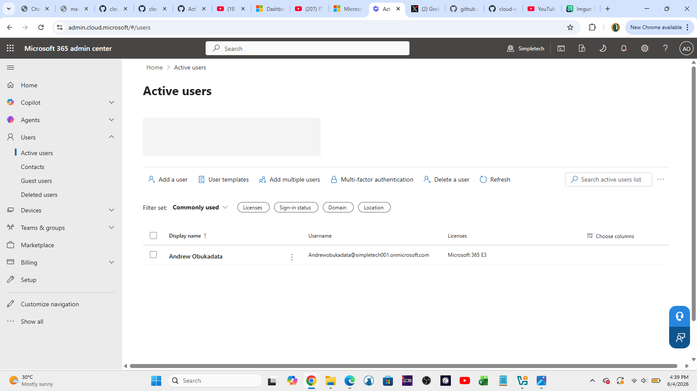
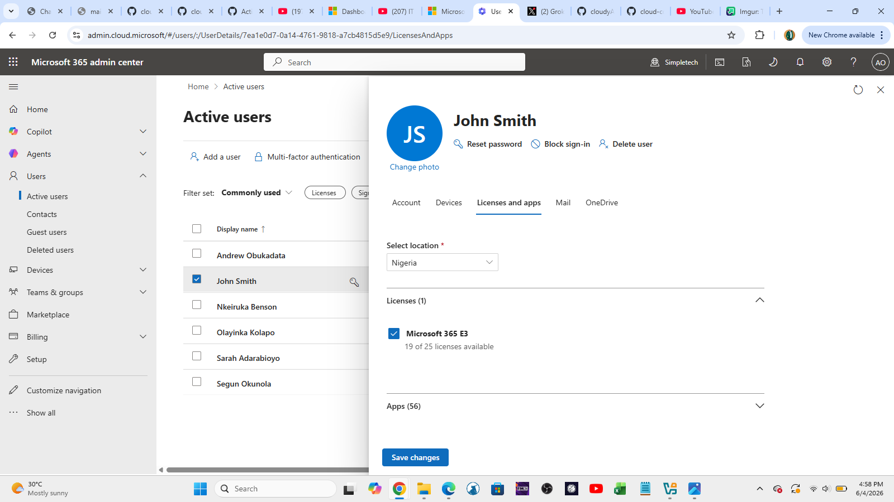
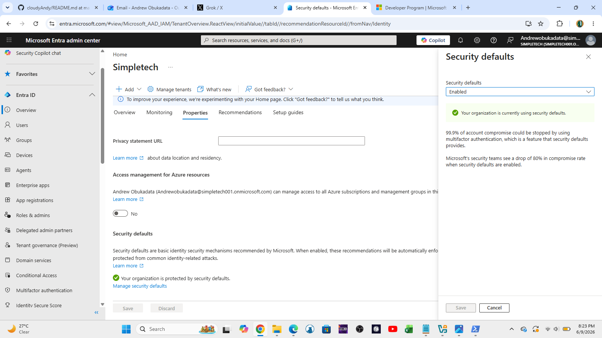
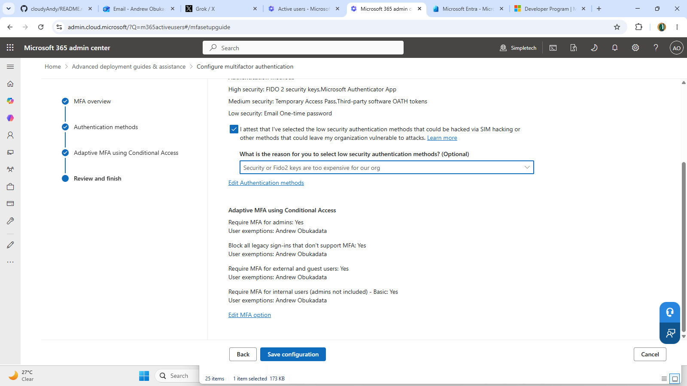
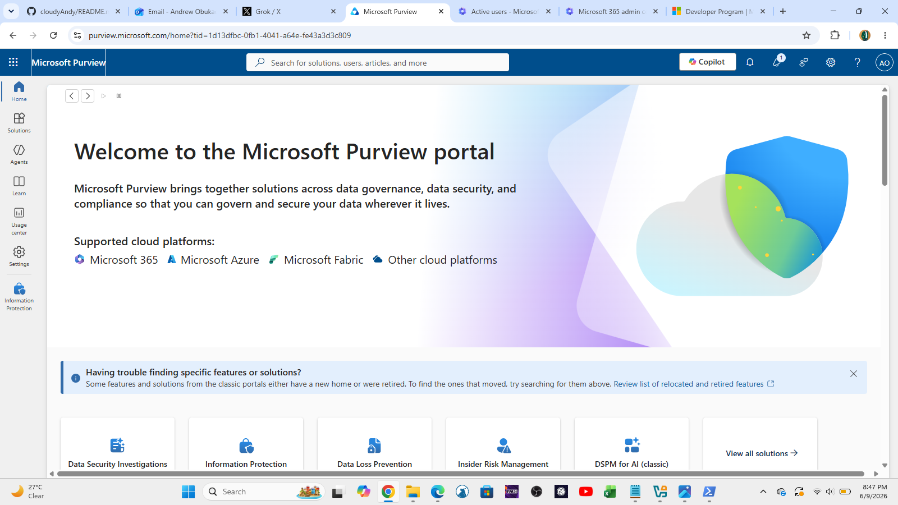
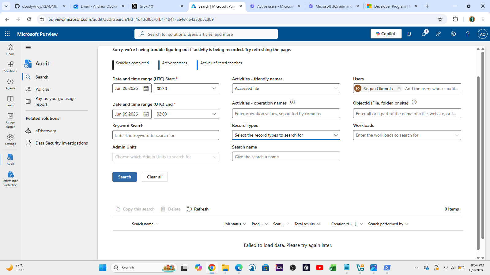
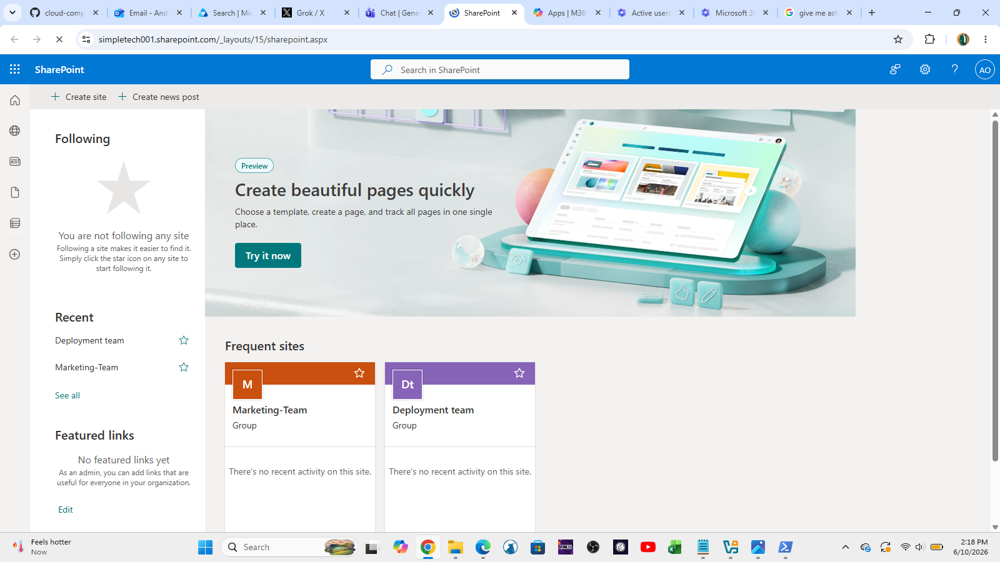
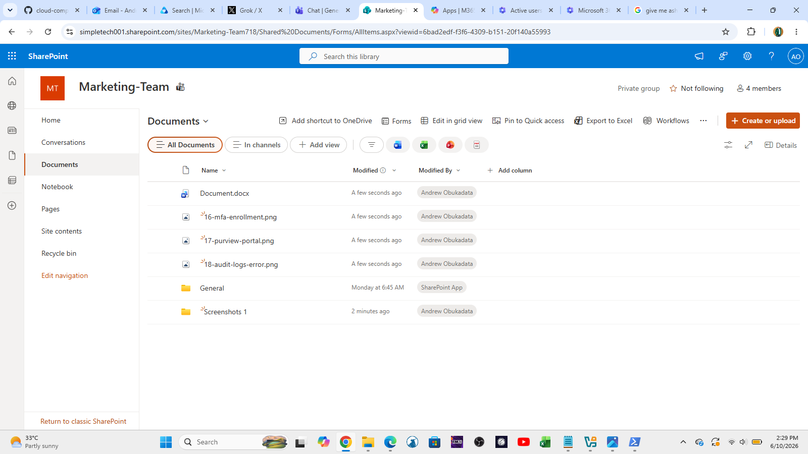
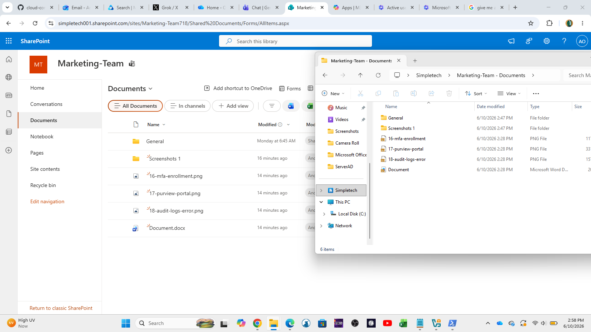
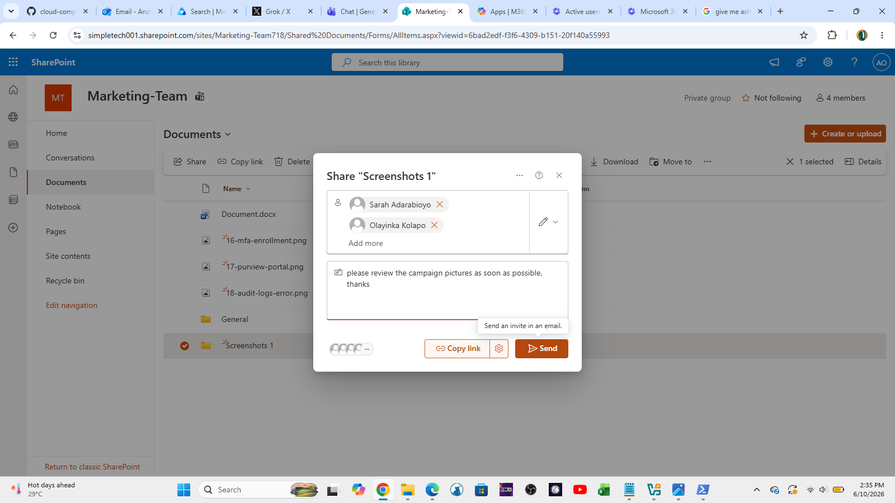

# Microsoft 365 Homelab

**Tenant Name**: simpletech001.onmicrosoft.com  
**License**: Microsoft 365 E3 Trial  
**Created**: June 2026  
**Users**: 6 (1 Admin + 5 Test Users)

This homelab is built to practice real-world **IT Support / Helpdesk** tasks in Microsoft 365.

### Screenshots
  
  
  

---

### Completed Projects

**✅ Tenant Exploration & Documentation**  
**✅ User Account Creation & License Assignment**  
**✅ Security Defaults (Already Enabled)**  
**✅ User & Group Management**  
**✅ Exchange Online Administration**  
**✅ Microsoft Teams Setup & Configuration**  
**✅ Basic Security & Compliance**  
**✅ SharePoint & OneDrive Support**

### User & Group Management

**Created:**
- 5 Test Users (John Smith, Nkeiruka Benson, Segun Okunola, Olayinka Kolapo, Sarah Adarabioyo)
- 3 Groups:
  - IT-Helpdesk (Security Group)
  - Finance-Team (Security Group)
  - Marketing-Team (Microsoft 365 Group)

**Screenshots**
  

**Skills Practiced:**
- Creating and managing users
- Assigning Microsoft 365 E3 licenses
- Creating Security Groups and Microsoft 365 Groups
- Adding members to groups

---

### Exchange Online Administration

**Completed:**
- Created Shared Mailbox (`ITSupport`)
- Configured Mailbox Delegation (Full Access + Send As)

**Screenshots**
  

---

### Microsoft Teams Administration & Support

**Completed:**
- Created Marketing-Team (Private Team)
- Added test users as members
- Created channels and tested collaboration

**Screenshots**
  
  
  
  

---

### Basic Security & Compliance

**Completed:**
- Reviewed Security Defaults (Enabled)
- Configured Multi-Factor Authentication (MFA)
- Explored Microsoft Purview & Audit Logs

**Screenshots**
  
  
  

---

### SharePoint & OneDrive Support

**Completed:**
- Created Marketing Team SharePoint Site
- Configured document library and permissions
- Tested internal sharing
- Synced library with OneDrive client
- Practiced common file access and sync scenarios

**Screenshots**
  
  
  

**Skills Practiced:**
- SharePoint Team Site management
- Document library permissions
- OneDrive sync troubleshooting
- File sharing and external access
- Common end-user support (access denied, sync issues, recovery)

---

### Next Projects To Complete
- [ ] PowerShell Automation Scripts
- [ ] Advanced Security & Compliance
      

---

**Last Updated**: June 10, 2026

**Goal**: Practical Microsoft 365 skills for **IT Support / Helpdesk** roles.
