# Microsoft 365 Homelab

**Tenant Name**: simpletech001.onmicrosoft.com  
**License**: Microsoft 365 E3 Trial  
**Created**: June 2026  
**Users**: 6 (1 Admin + 5 Test Users)

This homelab is built to practice real-world **IT Support / Helpdesk** tasks in Microsoft 365.

### Screenshots
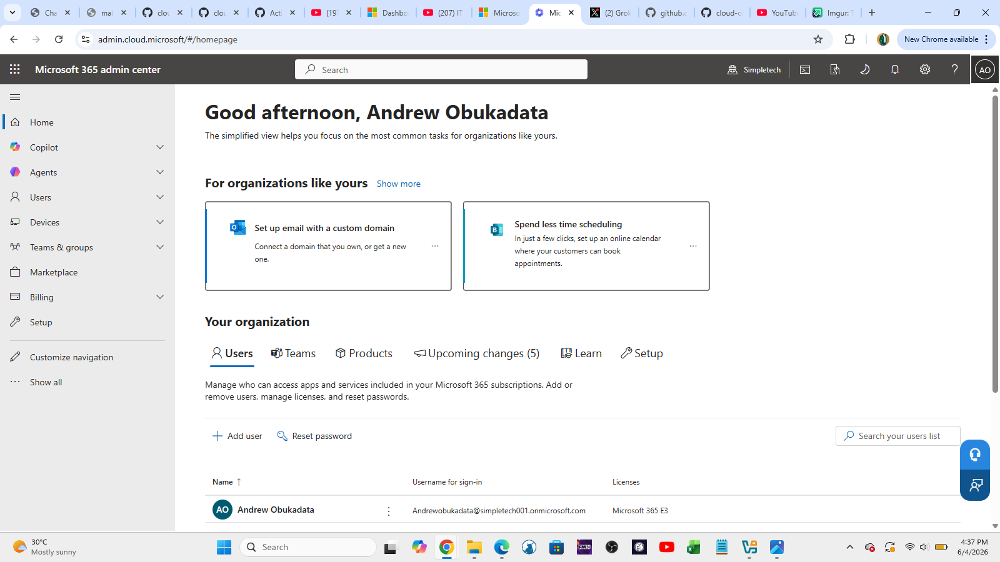  
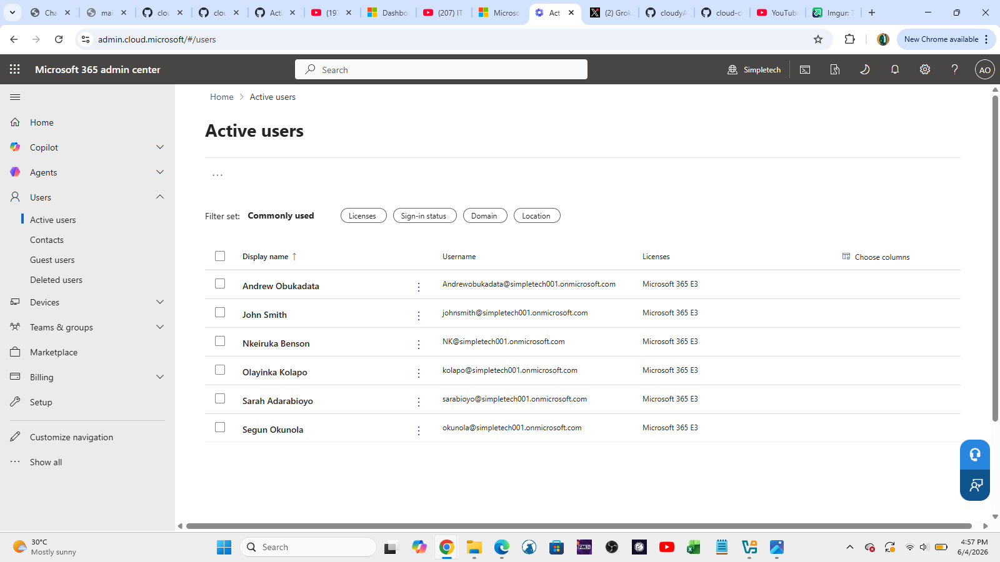

---

**Skills Practiced:**
- Tenant Exploration & Documentation  
- User Account Creation & License Assignment
- Assigning Microsoft 365 E3 licenses  
- User & Group Management

### User & Group Management

**Created:**
- 5 Test Users (John Smith, Nkeiruka Benson, Segun Okunola, Olayinka Kolapo, Sarah Adarabioyo)
- 3 Groups:
  - IT-Helpdesk (Security Group)
  - Finance-Team (Security Group)
  - Marketing-Team (Microsoft 365 Group)

**Screenshots**
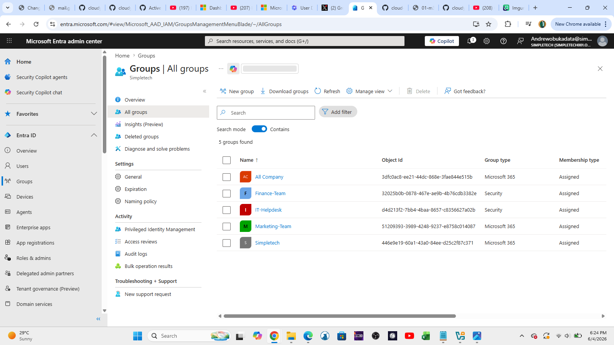  
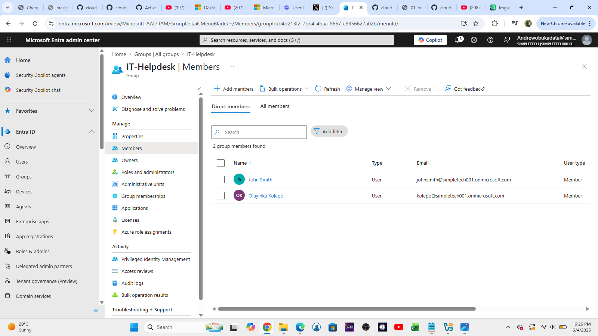

**Skills Practiced:**
- Creating and managing users
- Creating Security Groups and Microsoft 365 Groups
- Adding members to groups

---

### Exchange Online Administration

**Completed:**
- Created Shared Mailbox (`IT Support` / `ITSupport@simpletech001.onmicrosoft.com`)
- Configured Mailbox Delegation (Full Access + Send As)
- Tested mailbox access via "Open another mailbox"
- Experienced and troubleshot permission replication delay (common real-world issue)

**Screenshots**
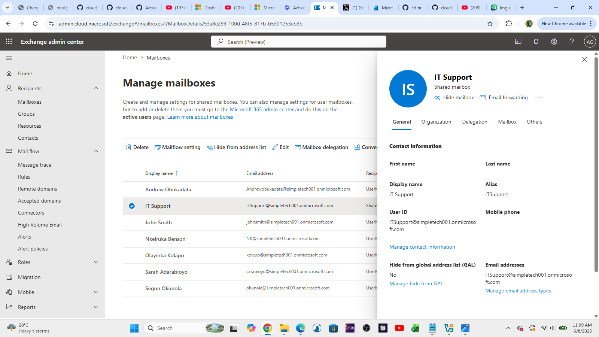  
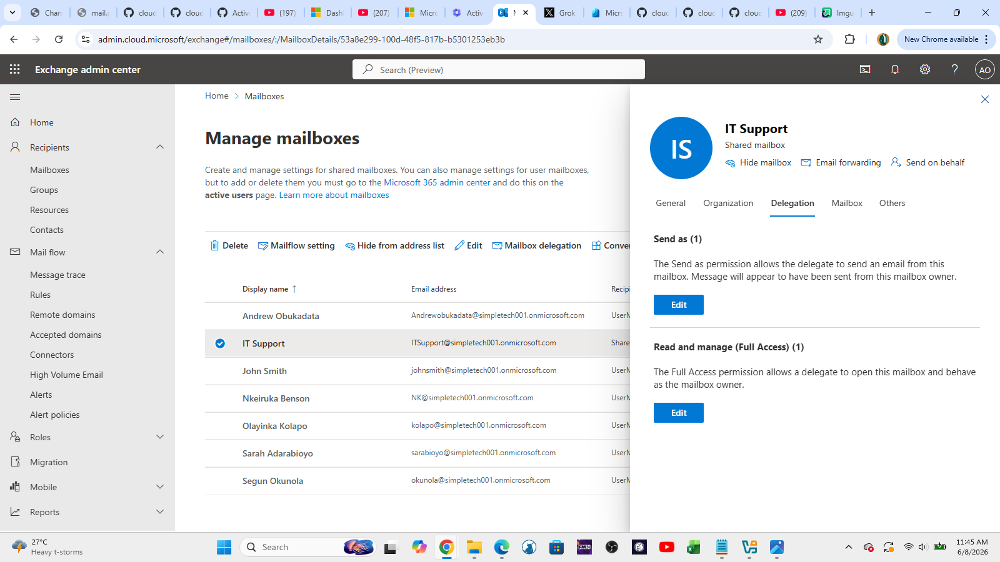

**Skills Practiced:**
- Creating and managing Shared Mailboxes
- Mailbox Delegation (Full Access & Send As)
- Troubleshooting permission propagation delays
  **Note:** Send As permission was granted but took longer than expected to replicate. Documented real-world troubleshooting process.

 
---

### Microsoft Teams Administration & Support

**Completed:**
- Created Marketing-Team (Private Team)
- Added test users as members
- Created Standard and Private channels
- Tested messaging, file sharing, and basic meeting functionality

**Screenshots**
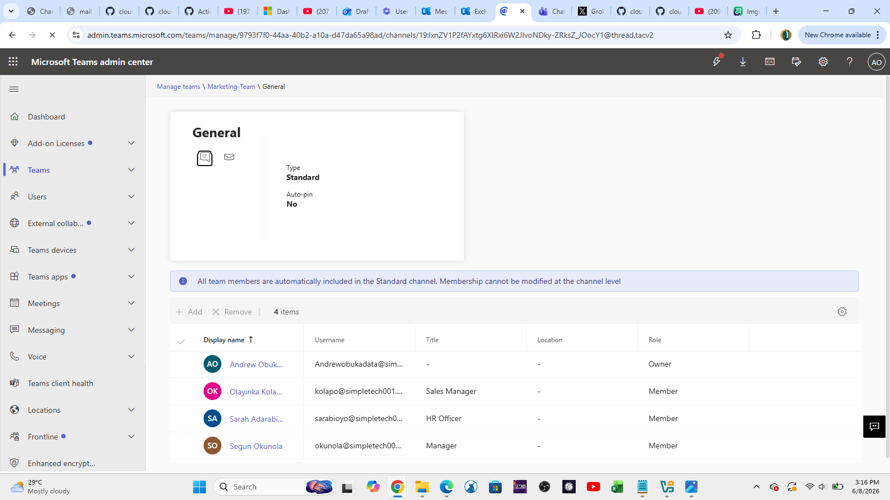  
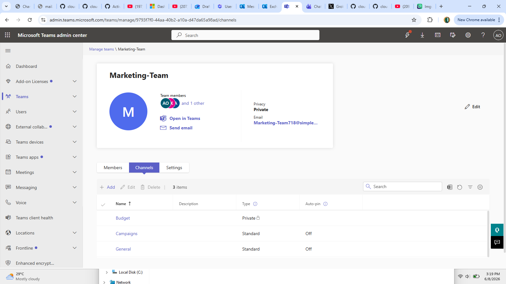  
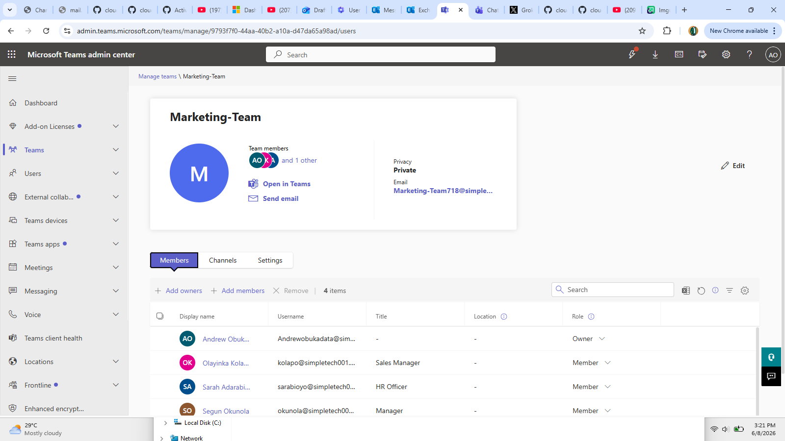  
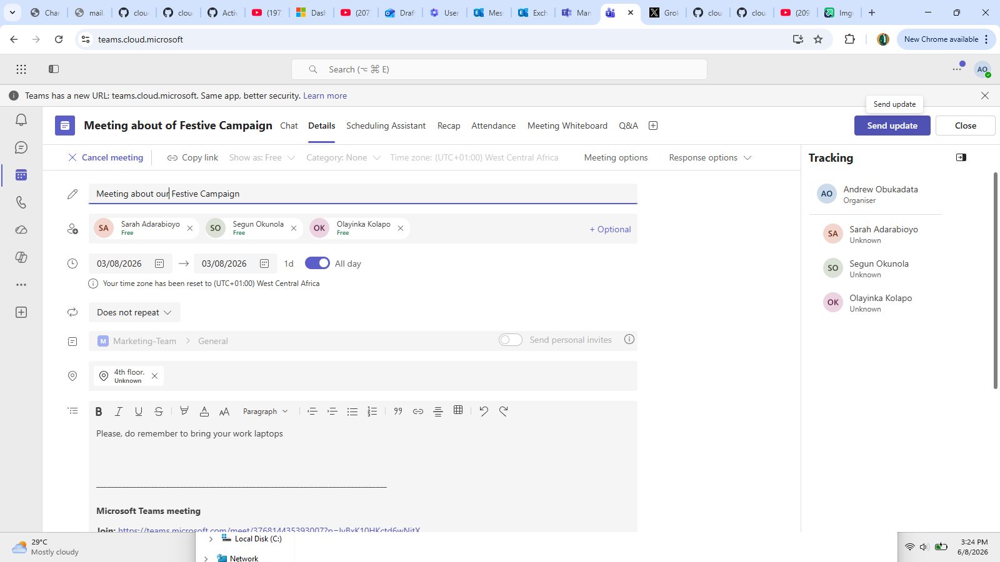
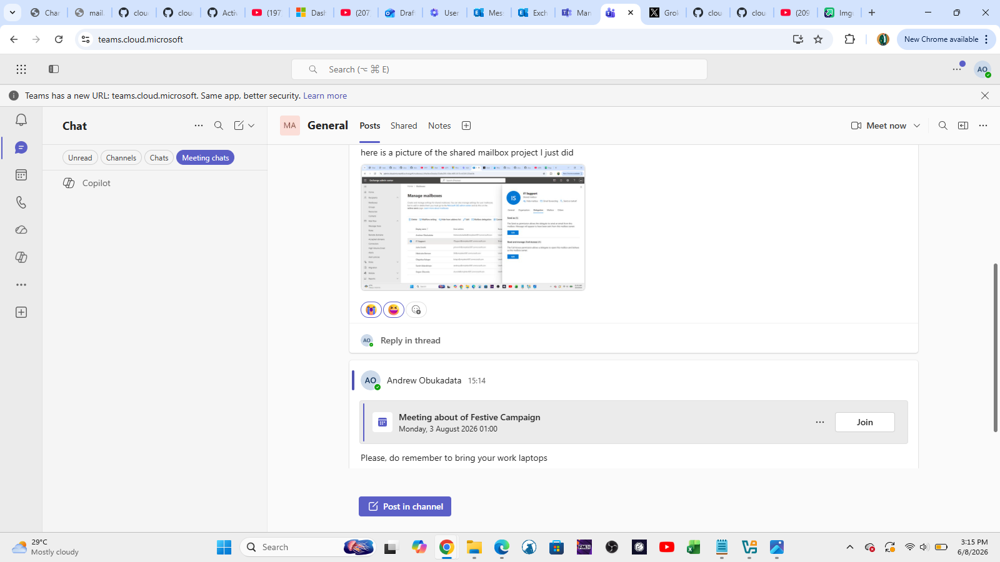

**Skills Practiced:**
- Creating and managing Teams
- Adding users to Teams
- Channel management (Standard vs Private channels)
- Collaboration tool support
- Common end-user Teams scenarios

**Note:** Overcame "We can't create deployment team" error (common in trial tenants).
### Next Projects To Complete

- [ ] PowerShell Automation Scripts
- [ ] Basic Security & Compliance

---

**Last Updated**: June 08, 2026
