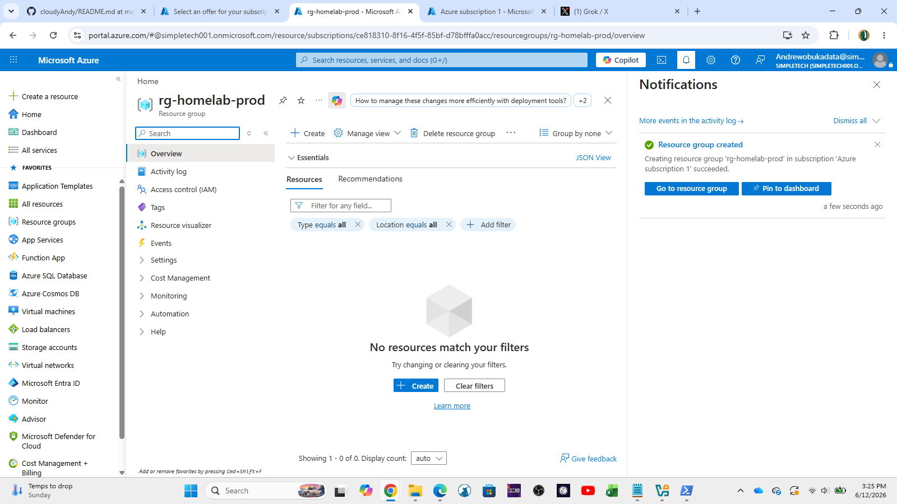
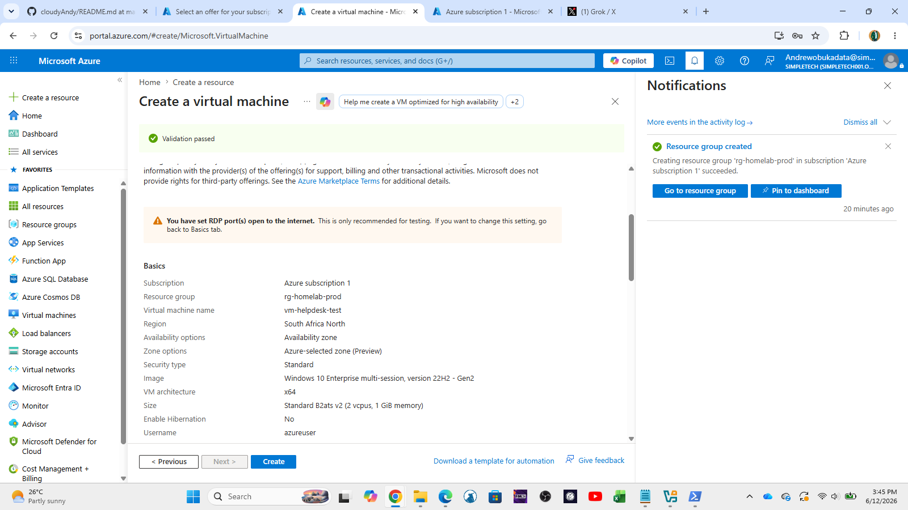
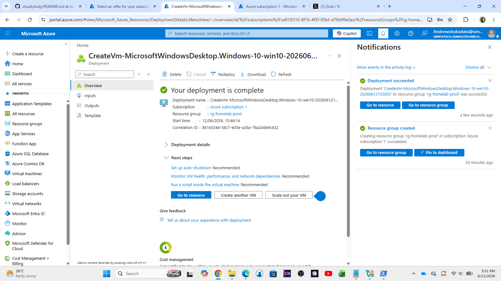
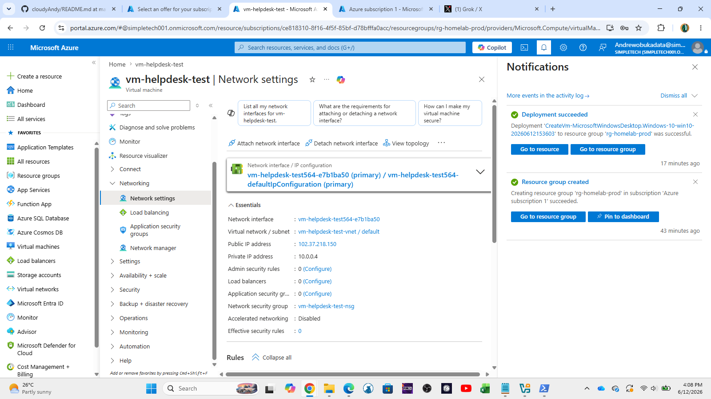
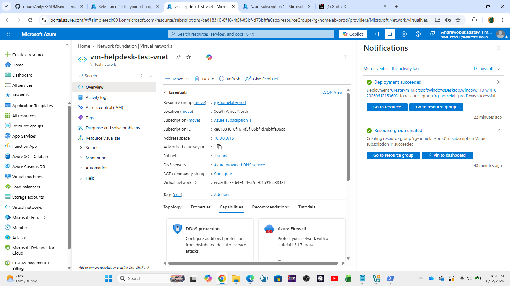
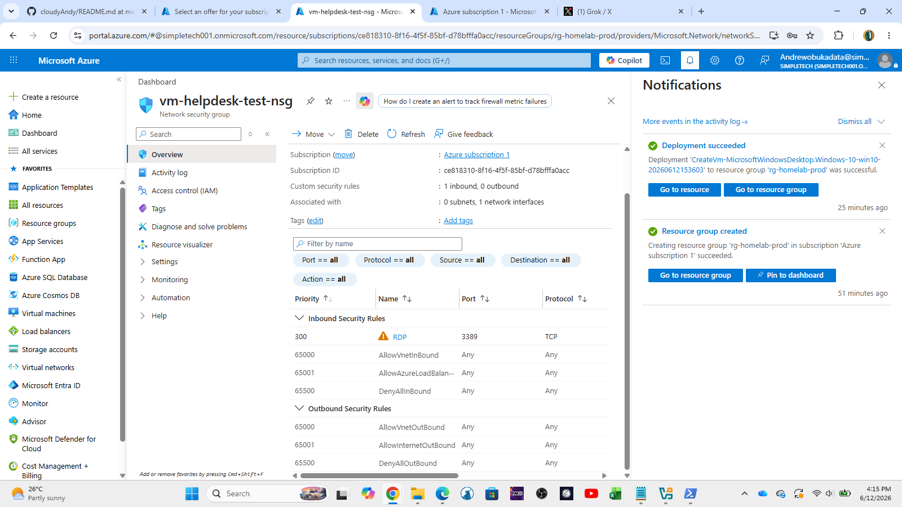
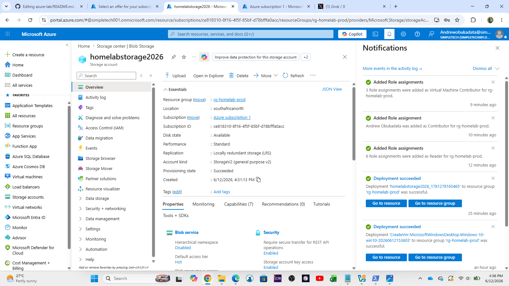
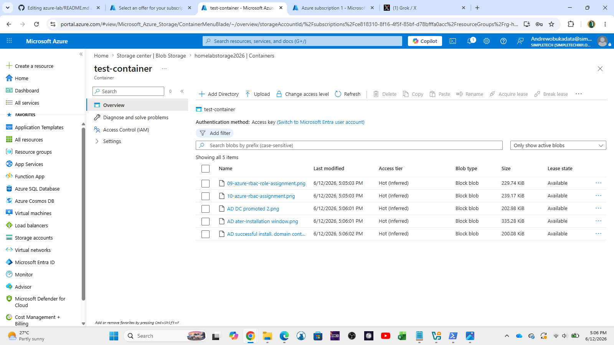
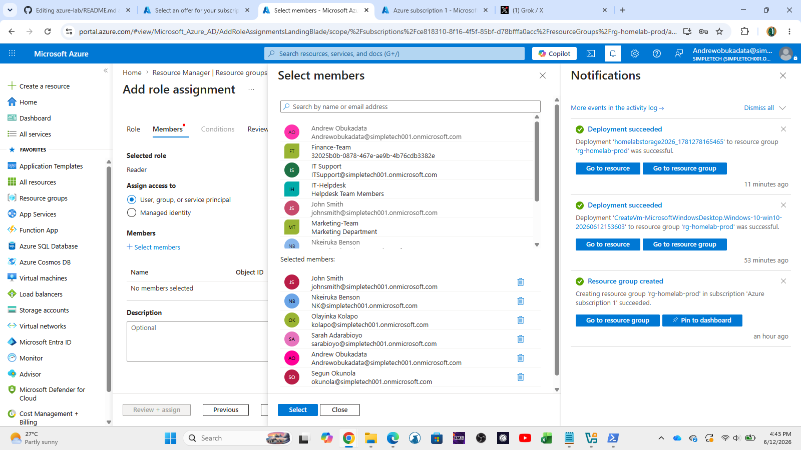
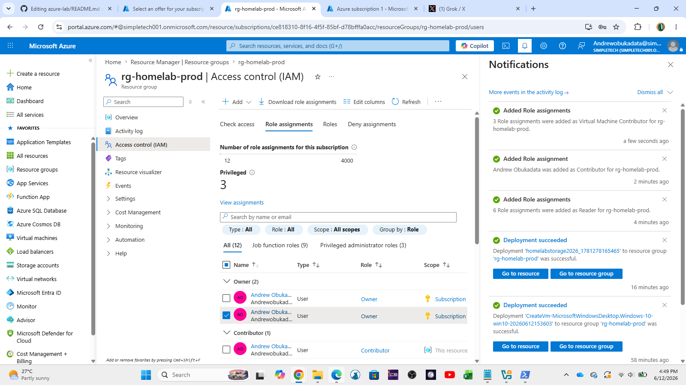

# Azure Lab

Hands-on Azure Free Tier lab focused on practical skills for **IT Support, Helpdesk, and Junior Cloud Administrator** roles.

### Lab Overview
- **Subscription**: Azure Free Tier  
- **Resource Group**: rg-homelab-prod  
- **Status**: In Progress

---

### ✅ Resource Groups
- Created dedicated Resource Group for the homelab

**Screenshots**

---

### ✅ Virtual Machines
- Deployed Windows Virtual Machine
- Configured RDP access

**Screenshots**
  
  

---

### ✅ Azure Networking
- Explored Virtual Network (VNet) and Subnets  
- Reviewed Network Security Group (NSG) rules

**Screenshots**
  

---

### ✅ Storage Accounts
- Created Storage Account  
- Uploaded files to Blob Container

**Screenshots**
  

---

### ✅ Role-Based Access Control (RBAC)
- Assigned built-in roles (Contributor, Reader, etc.)

**Screenshots**
  

---

### Skills Practiced
- Azure Resource Management
- Virtual Machine deployment and connectivity
- Azure Networking fundamentals
- Storage Account and Blob Storage management
- Role-Based Access Control (RBAC)

---

**Last Updated**: June 12, 2026

→ Back to [Main Homelab](../README.md)
