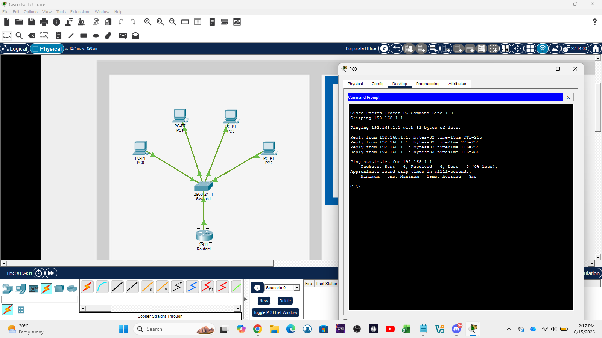
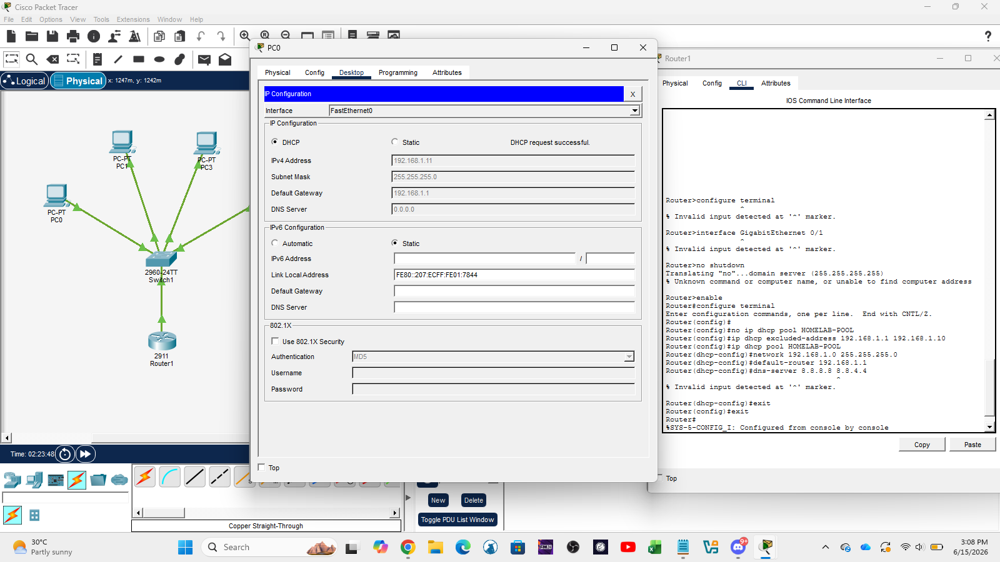
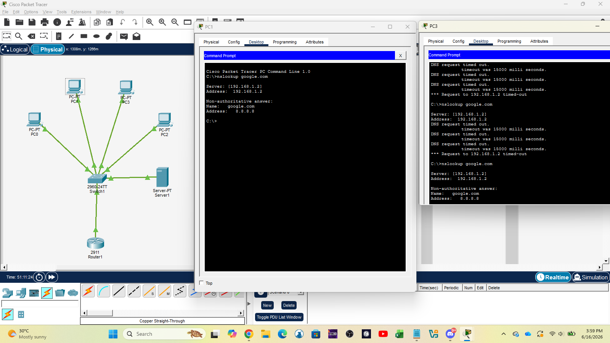

# Networking Lab

Hands-on Networking fundamentals lab for **IT Support and Helpdesk** 

### Lab Overview
- **Tools Used**: Cisco Packet Tracer
- **Focus**: Practical networking skills required for entry-level IT jobs
- **Status**: In Progress

---

### Completed Tasks

**Task 1: Basic Network Topology**
- Built a simple LAN using 1 Router, 1 Switch, and 4 PCs
- Connected devices using Copper Straight-Through cables
- Assigned static IP addresses and tested connectivity using `ping`
 **Screenshot**
  
  

  ---

**Task 2: DHCP Configuration**
- Configured the Router as a DHCP Server
- Created a DHCP pool and successfully assigned automatic IP addresses to client PCs
 **Screenshot**
    

  ---
  

**Task 3: DNS Configuration & Troubleshooting**
- Configured DNS settings on the network
- Troubleshot DNS resolution failure by changing DNS server from public (8.8.8.8) to local DNS server (192.168.1.2)
- Successfully tested with `nslookup google.com`
 **Screenshot**
    

---

### Skills Practiced
- Building basic network topology
- IP addressing (static and DHCP)
- DNS configuration and troubleshooting
- Using fundamental commands (`ping`, `nslookup`, `ipconfig`)

---

**Last Updated**: June 12, 2026

→ Back to [Main Homelab](../README.md)
